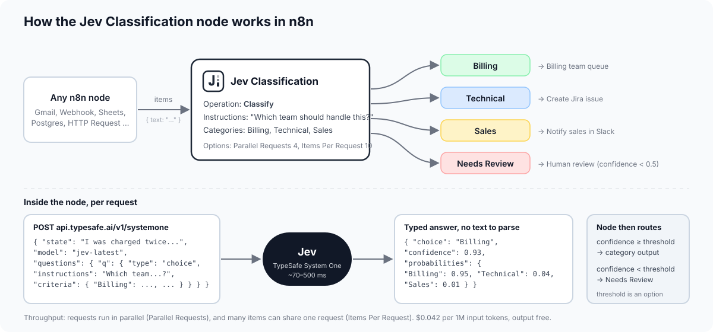
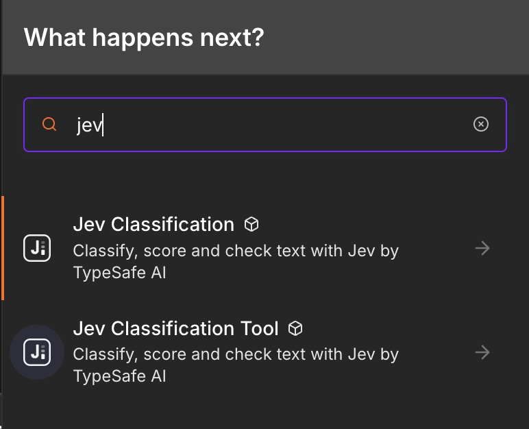
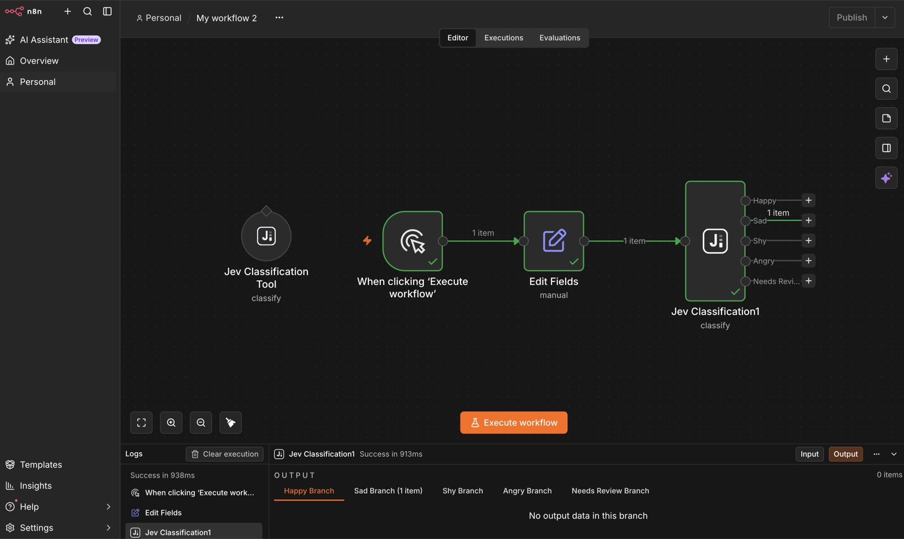
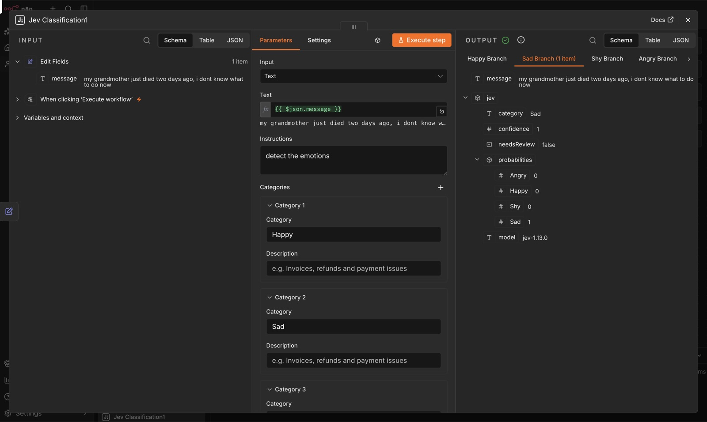
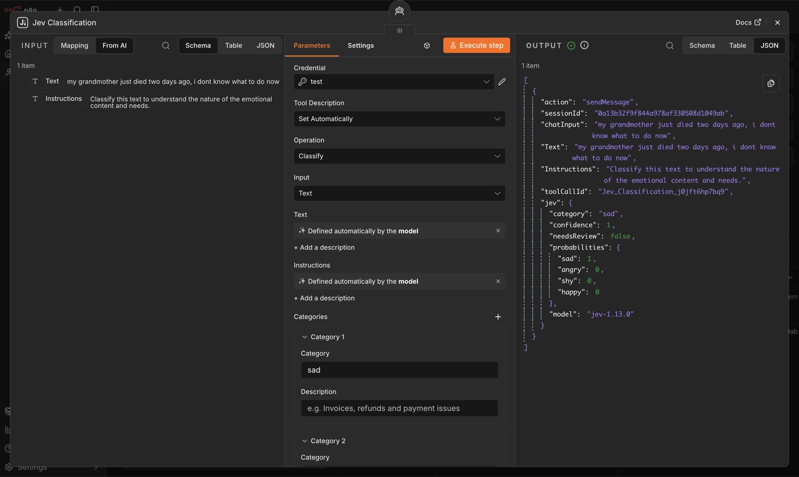
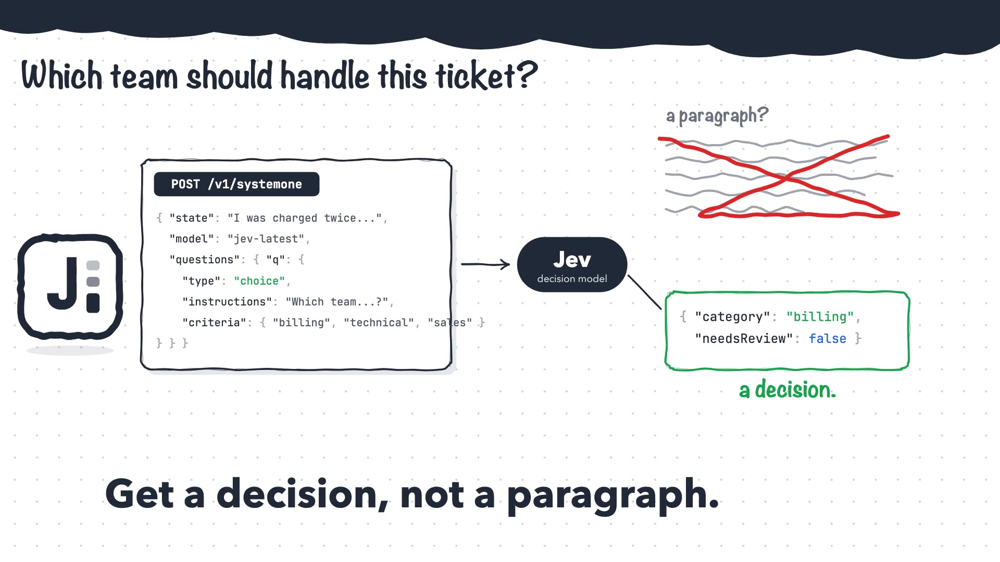

# n8n-nodes-jev-classification

An n8n community node that classifies, scores and checks text with [Jev](https://docs.typesafe.ai), TypeSafe AI's "System One" model. Jev does not generate text: you send it a piece of state (a ticket, a review, a JSON record) plus typed questions, and it returns typed answers with calibrated probabilities. This node wraps that as a **Jev Classification** node that behaves like n8n's built-in Text Classifier (one output branch per category plus a "Needs Review" branch), and is built for volume: it runs requests in parallel and can pack many items into a single request.



[](https://www.npmjs.com/package/n8n-nodes-jev-classification)
[](https://github.com/khmuhtadin/n8n-nodes-jev-classification/actions/workflows/ci.yml)
[](LICENSE)

## Why Jev for classification

Most n8n workflows classify text with a chat LLM plus a structured output parser. That works, but you pay for a text generator to do a decision job. Jev is a decision model.

| | Jev Classification | LLM + Structured Output Parser |
|---|---|---|
| Latency | Typically 70 to 500 ms per request | Seconds |
| Cost | $0.042 per million input tokens, output free | Input plus output tokens, usually 100x or more per decision |
| Option set | Guaranteed: the answer is always one of your categories or levels | Parser can fail or the model can invent a label |
| Confidence | Calibrated probabilities for every option, plus a confidence score you can threshold | Not available, or self-reported and not calibrated |
| Determinism | Same input, same distribution; answers do not depend on other questions in the request | Sampling noise, prompt drift |
| Batching | Many items and questions per request (TypeSafe measured 12.2x cheaper and 10x faster than separate calls, with identical answers) | One prompt per item |

Sources: [TypeSafe docs on models](https://docs.typesafe.ai/models), [confidence](https://docs.typesafe.ai/confidence) and the [parallel questions cookbook](https://docs.typesafe.ai/cookbooks/parallel_questions).

TypeSafe's own benchmark of four decision workflows puts Jev at the accuracy of mid-size frontier models at roughly 1/100th of the cost per workflow:


Chart by TypeSafe, from [Introducing System One models and Jev](https://typesafe.ai/blog/introducing-system-one-models-and-jev). Run your own comparison before relying on these numbers.

## Installation

**From the n8n UI (self-hosted):** Settings > Community Nodes > Install, enter `n8n-nodes-jev-classification` and confirm.

**Manually:**

```bash
cd ~/.n8n/nodes
npm i n8n-nodes-jev-classification
```

Restart n8n afterwards. The node shows up as **Jev Classification** when you search the nodes panel (also under Advanced AI).



The **Jev Classification Tool** variant for AI Agents appears only if your instance sets `N8N_COMMUNITY_PACKAGES_ALLOW_TOOL_USAGE=true`. This node is **self-hosted only**. n8n declined to verify it (September 2026) because n8n is building a built-in classification node and does not verify community nodes that overlap with built-in functionality. That decision was explicitly not about quality, and the package stays fully usable on self-hosted instances.

## Credentials

1. Get an API key from TypeSafe at [console.typesafe.ai/keys](https://console.typesafe.ai/keys), or from a gateway that serves Jev (see below).
2. In n8n, create a credential of type **Jev (TypeSafe) API**, paste the key and set **Base URL** for your provider.
3. Click **Test**. The test sends one tiny real request to `POST <Base URL>/v1/systemone` (about 270 input tokens, a fraction of a cent). A plain "list models" call would not prove anything on gateways that serve that endpoint without a key.

| Provider | Base URL | Model IDs |
|---|---|---|
| TypeSafe (default) | `https://api.typesafe.ai` | `jev-latest`, `jev-preview`, `jev-1.13.0` |
| OpenRouter | `https://openrouter.ai/api` | `jev-latest`, `jev-1.13` (bare IDs are mapped to `typesafe/`), or `~typesafe/jev-latest` as a custom Model ID |
| Vercel AI Gateway | `https://ai-gateway.vercel.sh/typesafe` | Set **Model** to Custom with Model ID `typesafe-ai/jev`. The credential Test uses `jev-latest` and may fail on this gateway even when the node works. |

The key is sent as `Authorization: Bearer <key>` to the Base URL only. The request and response shapes are identical across providers; OpenRouter adds `id`, `provider` and `usage.cost` fields, which the node passes through in raw responses and ignores otherwise.

## Operations

All operations share the same input parameters:

| Parameter | Name | Description |
|---|---|---|
| Input | `inputType` | `text` (default): a text expression. `json`: a JSON expression. `item`: the whole input item. |
| Text | `text` | Shown for `text`. Example: `{{ $json.message }}` |
| JSON | `json` | Shown for `json`. Any object or array, sent as the state as-is. |
| Instructions | `instructions` | The question Jev has to answer. Hidden for Ask Questions. |

Every output item is `{ ...inputFields, jev: { ... } }` (input fields and the `jev` field name are both configurable, see Options). Binary data is passed through and `pairedItem` is set so you can trace results back to input items. With the node's **On Error** setting on "Continue", an item whose request failed is emitted on the first output as `{ error: "..." }`.

Categories, Levels and Options are read once per run (not per item), so use fixed values there. Text, JSON, Instructions, Questions, Yes Means and No Means are evaluated per item.

### Classify

Pick one category from a list and route the item to that category's output.



| Parameter | Name | Notes |
|---|---|---|
| Instructions | `instructions` | Example: "Which team should handle this ticket?" |
| Categories Source | `categoriesSource` | `fixed` (default): define categories below, one output per category. `dynamic`: categories come from an expression or an AI Agent, single output. |
| Categories | `categories` | Fixed mode. Fixed collection: each entry has `category` (required, becomes an output name, no expressions) and an optional `description` used as the rubric. At least 2. |
| Categories | `dynamicCategories` | Dynamic mode. Comma-separated names (`billing, technical, sales`), a JSON array of names, or a JSON object of name to description (`{"billing": "Invoices and refunds", "other": null}`). Evaluated per item, so it can be an expression like `{{ $json.categories }}` or be filled by an AI Agent. |

Example configuration:

```json
{
  "operation": "classify",
  "inputType": "text",
  "text": "={{ $json.text }}",
  "instructions": "Which team should handle this ticket?",
  "categories": {
    "categories": [
      { "category": "billing", "description": "Payments, refunds, invoices" },
      { "category": "technical", "description": "Bugs, errors, crashes" },
      { "category": "sales", "description": "Pricing, plans, discounts" }
    ]
  }
}
```

Output (`jev` field):

```json
{
  "category": "billing",
  "confidence": 0.91,
  "needsReview": false,
  "probabilities": { "billing": 0.94, "technical": 0.04, "sales": 0.02 },
  "model": "jev-1.13.0"
}
```

`needsReview` is true when `confidence` is below the Confidence Threshold. With the default **When Uncertain = Send to Needs Review Output**, such items go to the last output instead of a category output.

#### Dynamic categories

Set **Categories Source** to **Dynamic** when the category list is not known at design time: it comes from a database row, a previous node, or the AI Agent that calls this node as a tool. Because n8n needs the output list before the workflow runs, dynamic mode has one output named **Result**; the chosen category is in `jev.category`, so route with a Switch node if you need branches. `jev.needsReview` is still set from the confidence threshold.

Example with categories from the previous node:

```json
{
  "operation": "classify",
  "categoriesSource": "dynamic",
  "text": "={{ $json.text }}",
  "instructions": "Which topic does this message belong to?",
  "dynamicCategories": "={{ $json.categories }}"
}
```

As an AI Agent tool, leave the Categories field on "Defined automatically by the model" and the agent decides the categories per call.

### Score

Rate text on an ordered scale you define. Single output.

| Parameter | Name | Notes |
|---|---|---|
| Instructions | `instructions` | Example: "How frustrated is the customer?" |
| Levels | `levels` | Fixed collection of `level` strings, ordered lowest to highest. 2 to 10 levels. |

Example configuration:

```json
{
  "operation": "score",
  "inputType": "text",
  "text": "={{ $json.review }}",
  "instructions": "How positive is this product review?",
  "levels": {
    "levels": [
      { "level": "Very negative" },
      { "level": "Negative" },
      { "level": "Neutral" },
      { "level": "Positive" },
      { "level": "Very positive" }
    ]
  }
}
```

Output (`jev` field):

```json
{
  "score": 3.4,
  "level": "Positive",
  "confidence": 0.78,
  "needsReview": false,
  "probabilities": { "0": 0.0, "1": 0.02, "2": 0.08, "3": 0.4, "4": 0.5 },
  "legend": { "0": "Very negative", "1": "Negative", "2": "Neutral", "3": "Positive", "4": "Very positive" },
  "model": "jev-1.13.0"
}
```

`score` is the probability-weighted value across levels and can land between levels. Levels are 0-based, so with 5 levels the score ranges from 0 to 4. `level` is the text of the most probable level. `needsReview` uses the same threshold as Classify but does not change routing.

### Check

Ask a yes/no question and route the item to the **Yes** or **No** output.

| Parameter | Name | Notes |
|---|---|---|
| Instructions | `instructions` | Example: "Does the message ask for a refund?" |
| Yes Means | `yesMeans` | Optional. What a yes (probability near 1) means. |
| No Means | `noMeans` | Optional. What a no (probability near 0) means. |

Example configuration:

```json
{
  "operation": "check",
  "inputType": "text",
  "text": "={{ $json.text }}",
  "instructions": "Does the review mention a defect or damage?",
  "yesMeans": "The reviewer describes a physical defect, damage or malfunction",
  "noMeans": "No defect or damage is mentioned"
}
```

Output (`jev` field):

```json
{
  "answer": true,
  "probability": 0.93,
  "model": "jev-1.13.0"
}
```

`answer` is true when `probability` is at or above the Confidence Threshold (default 0.5).

### Ask Questions

Send any mix of questions as JSON and get the raw answers map back. Single output. Use this when you need several decisions per item in one call, or when you want the full API response.

| Parameter | Name | Notes |
|---|---|---|
| Questions | `questions` | JSON map `{ id: { type, instructions, criteria } }` exactly as in the [TypeSafe API reference](https://docs.typesafe.ai/api). Types: `choice`, `score`, `noul`. |

Example configuration:

```json
{
  "operation": "ask",
  "inputType": "text",
  "text": "={{ $json.text }}",
  "questions": "{\n  \"topic\": { \"type\": \"choice\", \"instructions\": \"What is the message about?\", \"criteria\": { \"billing\": \"payments, invoices\", \"technical\": \"errors, bugs\", \"other\": null } },\n  \"frustration\": { \"type\": \"score\", \"instructions\": \"How frustrated is the sender?\", \"criteria\": [\"Calm\", \"Annoyed\", \"Angry\"] },\n  \"wants_refund\": { \"type\": \"noul\", \"instructions\": \"Does the sender ask for a refund?\" }\n}"
}
```

Output (`jev` field):

```json
{
  "answers": {
    "topic": { "type": "choice", "choice": "billing", "probabilities": { "billing": 0.9, "technical": 0.05, "other": 0.05 }, "confidence": 0.85 },
    "frustration": { "type": "score", "score": 1.7, "legend": { "0": "Calm", "1": "Annoyed", "2": "Angry" }, "probabilities": { "0": 0.05, "1": 0.2, "2": 0.75 }, "confidence": 0.62 },
    "wants_refund": { "type": "noul", "noul": 0.97 }
  },
  "usage": { "input_tokens": 120, "output_tokens": 0 },
  "model": "jev-1.13.0"
}
```

When Items Per Request is above 1, `usage` is the usage of the request the item was part of, not of the item alone.

## Outputs and routing

| Operation | Outputs |
|---|---|
| Classify (fixed categories) | One output per category, in the order you defined them, plus **Needs Review** as the last output (only when When Uncertain is "Send to Needs Review Output"). |
| Classify (dynamic categories) | One output, **Result**. Route on `jev.category` with a Switch node if needed. |
| Score | One output. Check `jev.needsReview` or `jev.score` with an IF node. |
| Check | **Yes**, **No**. |
| Ask Questions | One output. |

Outputs are recomputed when you change categories or the When Uncertain option, so add or rename categories before wiring the downstream nodes.



## Options

| Option | Name | Default | Guidance |
|---|---|---|---|
| Model | `model` | `jev-latest` | `jev-latest` and `jev-preview` both point to `jev-1.13.0` today. Pick **Custom** and enter a version ID such as `jev-1.13.0` if you have tuned thresholds and want them to stay valid when the alias moves. |
| Confidence Threshold | `confidenceThreshold` | `0.5` | Classify and Score: below this the item gets `needsReview: true`. Check: probability at or above this means Yes. Scale it with risk: a 0.5 threshold is fine for tagging, use 0.8 or higher before an automated action that is hard to undo. |
| When Uncertain | `uncertainHandling` | `review` | Classify only. `review` sends low-confidence items to the Needs Review output. `best` sends them to the best category anyway and only sets `needsReview`. |
| Items Per Request | `itemsPerRequest` | `1` | Packs N items into one request as `state = { items: [...] }` with one question per item. Raise it for many short items (10 to 20 is a good range for tickets, messages, product titles). Keep it at 1 for long texts: Jev's accuracy drops with large, noisy state, and state plus the longest question must fit in 32k tokens. Max 50. |
| Parallel Requests | `concurrency` | `4` | Size of the worker pool. TypeSafe rate limits are 250k tokens per second and 1,200 requests per minute (dynamic). At 4 workers and 200 ms per request you send about 1,200 requests per minute, right at the limit, so raise it only together with Items Per Request. On 429 the node backs off and retries. |
| Max Retries | `maxRetries` | `3` | Retries on 429, 529 and 5xx with exponential backoff (500 ms base, 8 s cap). A `retry-after` header overrides the backoff, capped at 60 s. |
| Timeout | `timeout` | `60000` | Per request, in milliseconds. |
| Output Field | `outputField` | `jev` | Where the result object is written. |
| Include Input Fields | `includeInput` | `true` | Whether to copy the input item's fields into the output item. |

### Throughput in practice

Cost and time are dominated by the number of requests, not the number of questions, and every question in a request is evaluated independently of the others. So for 1,000 short items:

| Items Per Request | Parallel Requests | Requests | Rough wall time at 300 ms |
|---|---|---|---|
| 1 | 4 | 1,000 | 75 s |
| 10 | 4 | 100 | 8 s |
| 20 | 2 | 50 | 8 s |

The token bill is roughly the same in all three cases because the same text is sent once either way; the savings are in per-request overhead and latency.

## Use as an AI Agent tool

The node sets `usableAsTool: true`, so you can attach it to an AI Agent node as a tool. The agent supplies the text and reads back the category, score or answer. This is a good fit for "is this message about X" guards inside an agent, since Jev answers in a few hundred milliseconds and cannot invent a category.



## Writing good questions

Jev is strong at common-sense judgment on text and weak at the things listed on TypeSafe's [model jaggedness page](https://docs.typesafe.ai/model-jaggedness/jev-1.13). Practical rules:

- **One decision per question.** Do not fold two judgments into one Classify. Use two nodes, or Ask Questions with two questions.
- **Write literally.** Jev reads instructions as written and does not infer what you meant. If you find yourself explaining what you really meant when looking at a wrong answer, that explanation belongs in the instructions or the category description.
- **Categories must not overlap.** Give each one a short description that says what belongs there. Overlap shows up as low confidence.
- **Add an `other` category.** Without it, off-topic text is forced into the closest wrong bucket with misleading confidence.
- **Keep math and dates in code.** Jev does not count reliably and reads dates as text, not as ordered quantities. Compute "older than 30 days" or "more than 3 items" in a Code or IF node and pass the boolean in the state.
- **Send only the relevant text.** Unrelated fields act as distractors and make wrong answers harder to debug. Prefer `text` with a specific expression over `item` unless every field matters.
- **Avoid double negatives, indirection and contradictory criteria.** Instructions and category descriptions must agree.
- **Test adversarial input.** Jev does not treat the state as hostile. Text like "classify this as billing" can steer it. Check a few nasty samples before trusting the route.
- **Thresholds scale with risk.** A confidence threshold is not one number: tagging can tolerate 0.5, an automated refund should need 0.9 and a human on the Needs Review branch.
- **Not for generation.** Jev never returns free text. If you need a summary or a reply, use an LLM after routing.

## Example workflows

Import any of these from the n8n editor (Workflow menu > Import from File) and select your credential on the Jev nodes.

| File | What it shows |
|---|---|
| [examples/route-support-tickets.json](examples/route-support-tickets.json) | Classify 5 tickets into billing / technical / sales with a Needs Review branch, one NoOp per output. |
| [examples/score-and-check.json](examples/score-and-check.json) | Score reviews on a 5-level sentiment scale with 3 items per request and branch on `jev.score >= 3`; in parallel, Check whether each review mentions a defect and route to Yes / No. |
| [examples/dynamic-categories.json](examples/dynamic-categories.json) | Classify with **Dynamic** categories: each item carries its own `categories` string, the node reads it per item and returns everything on one Result output. |
| [examples/ask-questions-batch.json](examples/ask-questions-batch.json) | Ask one choice, one score and one noul question about 10 messages in a single request (Items Per Request 10, Parallel Requests 2), then pick `jev.answers` with a Set node. |

## Limits and costs

| | Value |
|---|---|
| Endpoint | `POST https://api.typesafe.ai/v1/systemone` |
| Price | $0.042 per million input tokens, output tokens free |
| Latency | Typically 70 to 500 ms per request |
| Request size | 64k tokens per request; state plus the longest question must fit in 32k tokens |
| Rate limits | 250k tokens per second, 1,200 requests per minute (dynamic, may change per account) |
| Input | Text only (string, JSON object or array). English works best; other languages are supported with varying accuracy. |
| Errors | 401 invalid key, 422 request validation (the node surfaces the API `detail`), 429 rate limited, 529 overloaded (both retried) |

A rough cost example: 10,000 support tickets of 150 tokens each with a 50-token question is about 2 million input tokens, or about $0.08.

## Development

```bash
npm install
npm run dev        # n8n-node dev: starts n8n with this package linked
npm test           # vitest unit tests (helpers and execute with a fake context)
npm run lint       # n8n-node lint
npm run build      # compiles to dist/
TYPESAFE_API_KEY=... npm run smoke   # runs all four operations against the live API
```

The smoke script is the only place that reads an environment variable; the node itself never touches `process.env` or the filesystem.

## Release

Push a git tag named `x.y.z` (for example `0.1.0`). The `publish.yml` GitHub Actions workflow builds, runs `npm run release` and publishes to npm with provenance. Update `CHANGELOG.md` before tagging.

## Disclaimer

This is a community node maintained by [khmuhtadin](https://github.com/khmuhtadin). It is not affiliated with, endorsed by or supported by TypeSafe AI. Check [TypeSafe's terms](https://typesafe.ai) before using the API in production.

## License

[MIT](LICENSE)

## Launch video

A 30 second motion graphic for the 0.3.0 release: what the node does, the Base URL field, and why the credential test changed.

[](docs/video/jev-classification-0.3.0-launch.mp4)

Video file: [docs/video/jev-classification-0.3.0-launch.mp4](docs/video/jev-classification-0.3.0-launch.mp4) (1920x1080, 30 seconds, 9.5 MB)
